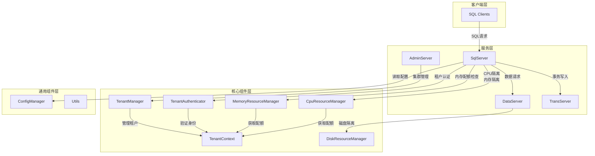
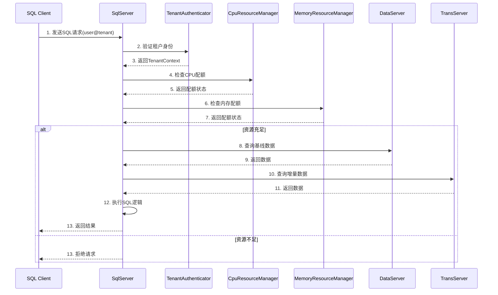
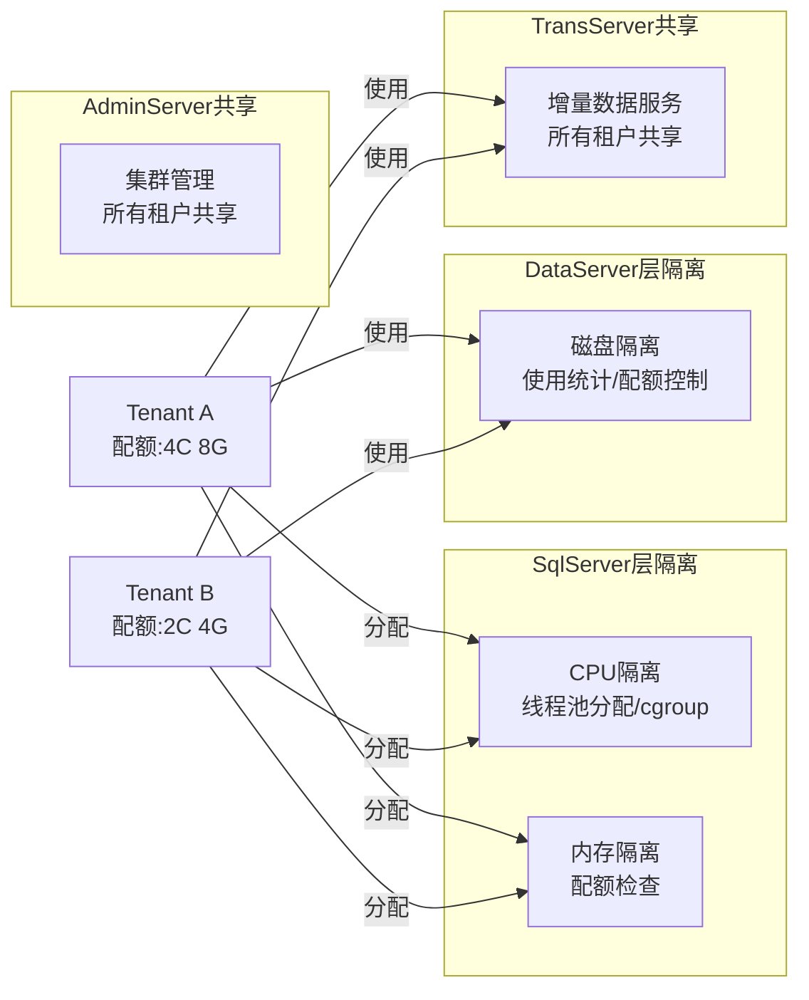
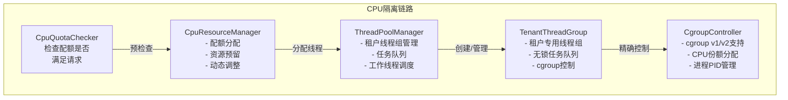
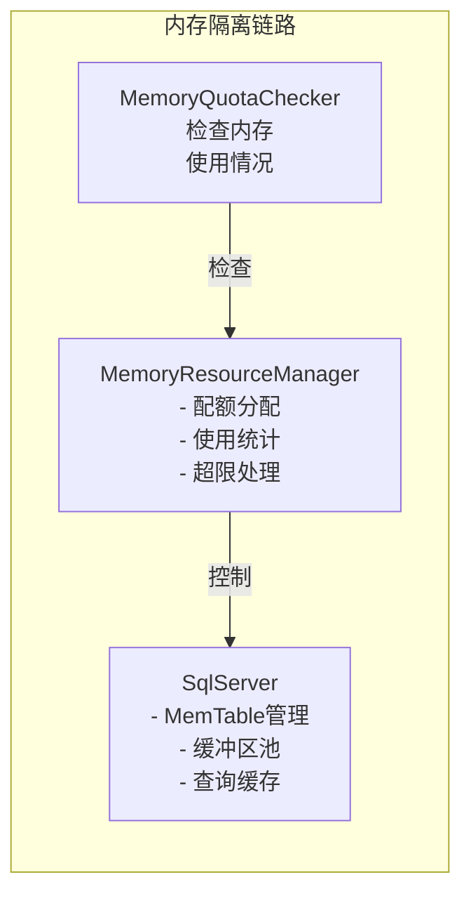
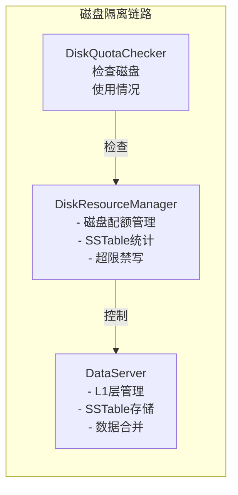
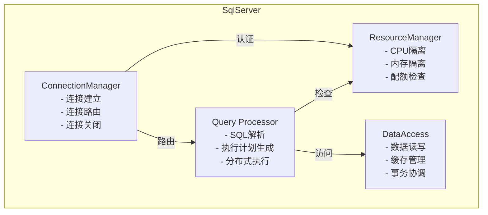
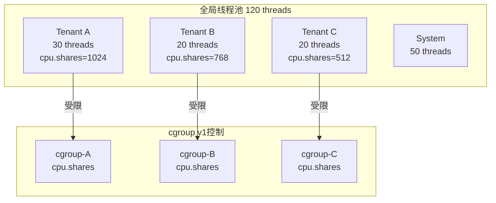
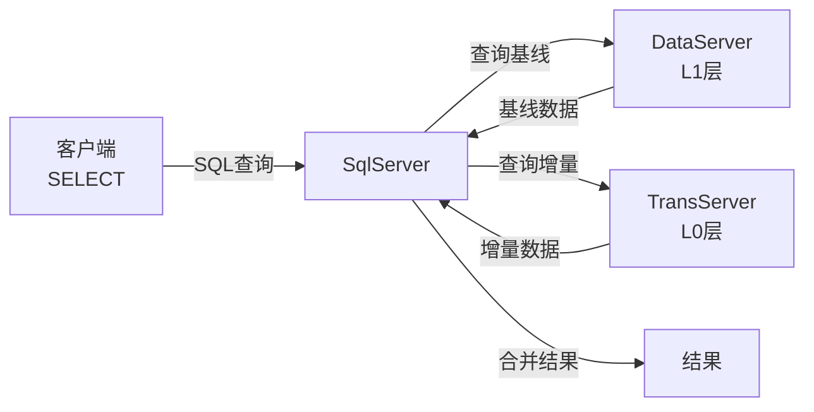
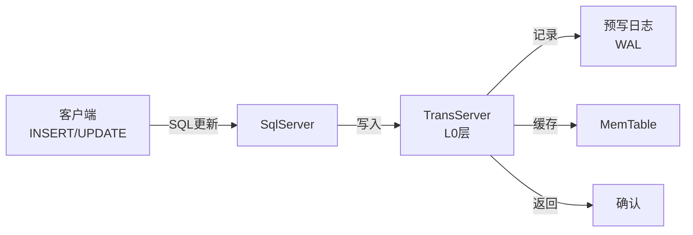

# YaoBase 多租户资源隔离系统 - 架构概览

## 系统层级架构

## 请求处理数据流

## 租户资源隔离分层

## 核心组件详解 - CPU隔离

## 核心组件详解 - 内存隔离

## 核心组件详解 - 磁盘隔离

## 服务器架构 - SqlServer

## 工作线程模型

## 读取流程

## 写入流程

## 关键接口契约

### TenantContext 接口
- `getTenantId()` - 获取租户ID
- `getCpuQuota()` - 获取CPU配额
- `getMemoryQuota()` - 获取内存配额
- `getDiskQuota()` - 获取磁盘配额

### ResourceStats 接口
- `getCpuUsage()` - CPU使用统计
- `getMemoryUsage()` - 内存使用统计
- `getDiskUsage()` - 磁盘使用统计

### CpuResourceManager 接口
- `allocateCpu(tenantId, cores)` - 分配CPU
- `releaseCpu(tenantId)` - 释放CPU
- `getCpuStatus(tenantId)` - 获取CPU状态

### MemoryResourceManager 接口
- `allocateMemory(tenantId, bytes)` - 分配内存
- `releaseMemory(tenantId)` - 释放内存
- `getMemoryStatus(tenantId)` - 获取内存状态

### DiskResourceManager 接口
- `allocateDisk(tenantId, bytes)` - 分配磁盘
- `releaseDisk(tenantId)` - 释放磁盘
- `getDiskStatus(tenantId)` - 获取磁盘状态

## 性能指标和SLA

### 目标性能指标
- **请求延迟**: < 10ms (p99)
- **CPU隔离准确度**: > 99.9%
- **内存隔离准确度**: > 99.5%
- **系统开销**: < 5%
- **并发租户数**: 1000+

### 失败模式和容错

| 故障类型 | 行为 | 恢复 |
|---------|------|------|
| CPU配额超限 | 限流/降优先级 | 自动恢复 |
| 内存溢出 | 拒绝新请求 | 等待内存释放 |
| 磁盘满 | 禁止写入 | 数据合并释放空间 |
| cgroup失败 | 降级到基础模式 | 使用线程池比例控制 |
| 租户认证失败 | 拒绝连接 | 客户端重试 |

## 架构设计原则

1. **最小侵入** - 尽量减少对现有架构的修改
2. **渐进式** - 先实现基础隔离，后续可扩展高级功能
3. **租户感知** - 在关键路径传递租户上下文
4. **可配置** - 提供灵活的配置选项
5. **可监控** - 提供完整的资源使用监控能力

---

Generated with GitHub Copilot - HLBPA Mode
